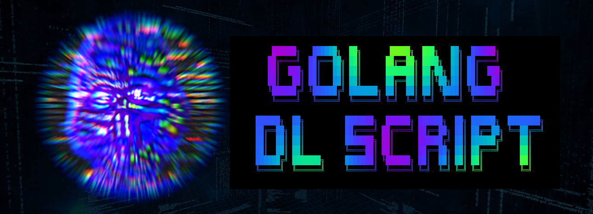

<p align="center">
بِسْمِ اللهِ الرَّحْمٰنِ الرَّحِيْمِ
</p>
<p align="center">


</p>

[](https://www.youtube.com/@m0ham3dxx)

----
1. [Demo](#demo)
2. [WatDo ?](#watdo-)
   1. [Huh ?](#huh-)
   2. [Why ?](#why-)
3. [How ?](#how-)
   1. [Get](#get)
      1. [Run](#run)
      2. [Build](#build)
4. [Warning](#warning)

----

# Demo


# WatDo ?

> This is a scriot downloader which has been made using golang 

```ml
https://snips.sh/f/uEf7aLoioN
```
## Huh ?

<details>
<summary> 🐦 </summary>

[](https://twitter.com/m0ham3dxx/status/1673939781791653888?s=20)

</details>

## Why ? 

1. To learn go for its native HTTP packages
2. To practice usage of [lipgloss](https://github.com/charmbracelet/lipgloss), the **BEST** styler for golang

# How ? 


## Get  
1. DL latest release from [here](https://github.com/m0ham3dx/mx-wdfs-g/releases/tag/v0.0.1)

### Run
```go
go run src/main.go
```

### Build

```go 
go build src/main.go
```

# Warning 

> Use at your own discrection. I am not responsible for any damage caused by this script, moreover I wil LOL if you open an issue regarding it.
